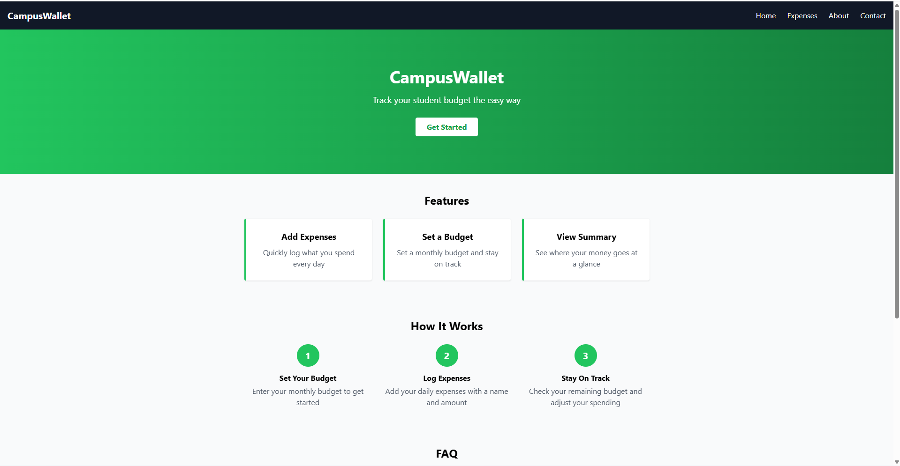
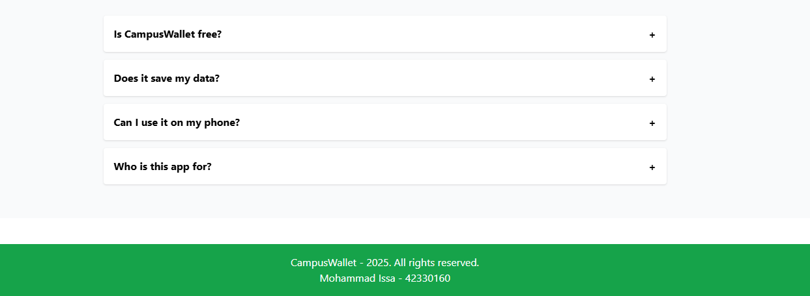
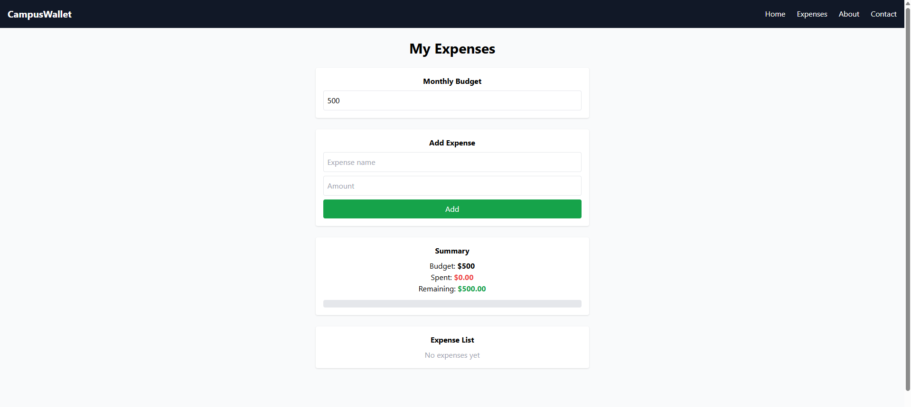
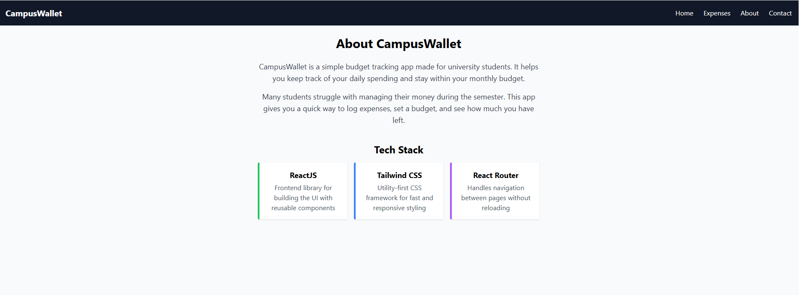
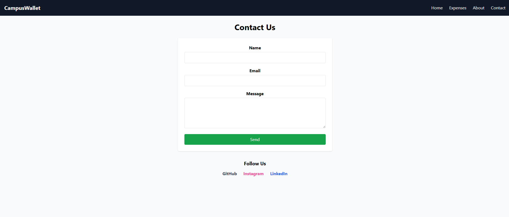

# CampusWallet

CampusWallet is a simple budget tracking web app made for university students. It helps you log your daily expenses, set a monthly budget, and see how much you have left.

## Features

1. Set a monthly budget
2. Add, edit, and delete expenses
3. View a summary of your spending with a progress bar
4. Duplicate expense name detection
5. Responsive design (works on desktop and mobile)
6. FAQ section on the landing page

## Pages

1. Home: landing page with features, how it works, and FAQ
2. Expenses: add and manage your expenses
3. About: information about the app
4. Contact: contact form

## Technologies Used

1. ReactJS
2. Tailwind CSS
3. React Router DOM

## How to Run

1. Clone the repo: git clone https://github.com/mhmdtriobyte/campus-wallet.git
2. Go into the folder: cd campus-wallet
3. Install dependencies: npm install
4. Start the app: npm start
5. Open http://localhost:3000 in your browser

## Screenshots

## Author

Mohammad Issa (42330160)
